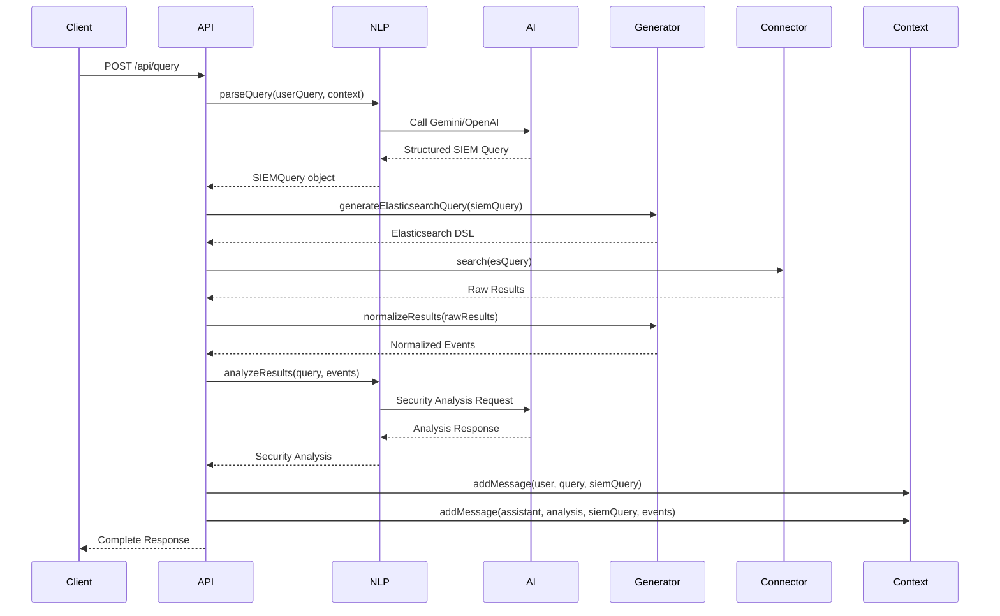

# SIEM NLP Layer - Architecture & Flow Documentation

## Overview

The SIEM NLP Layer is a natural language processing system that converts human-readable security queries into structured SIEM queries and executes them against Elasticsearch or Wazuh platforms. It provides intelligent analysis of security events and maintains conversation context.

## System Architecture

```
┌─────────────────┐    ┌─────────────────┐    ┌─────────────────┐
│   Client App    │───▶│  Express API    │───▶│  NLP Parser     │
└─────────────────┘    └─────────────────┘    └─────────────────┘
                                │                        │
                                ▼                        ▼
                       ┌─────────────────┐    ┌─────────────────┐
                       │ Query Generator │◀───│  AI Models      │
                       └─────────────────┘    │ (Gemini/OpenAI) │
                                │              └─────────────────┘
                                ▼
                       ┌─────────────────┐
                       │   Connectors    │
                       │ ┌─────────────┐ │
                       │ │Elasticsearch│ │
                       │ └─────────────┘ │
                       │ ┌─────────────┐ │
                       │ │   Wazuh     │ │
                       │ └─────────────┘ │
                       └─────────────────┘
                                │
                                ▼
                       ┌─────────────────┐
                       │ Context Manager │
                       └─────────────────┘
```

## Core Components

### 1. Express API Server (`src/app.ts`)

- **Purpose**: Main application entry point
- **Features**:
  - CORS enabled for cross-origin requests
  - JSON/URL-encoded body parsing
  - Error handling middleware
  - Health check endpoint

### 2. Query Routes (`src/routes/query.ts`)

- **Purpose**: Handles all query-related API endpoints
- **Endpoints**:
  - `POST /api/query` - Main query processing
  - `GET /api/context` - Retrieve conversation history
  - `DELETE /api/context` - Clear conversation history
  - `GET /api/health` - System health check
  - `GET /api/debug/mapping` - Elasticsearch index mapping

### 3. NLP Parser (`src/nlp/NLPParser.ts`)

- **Purpose**: Converts natural language to structured SIEM queries
- **AI Models**: Supports both Gemini and OpenAI
- **Key Methods**:
  - `parseQuery()` - Converts user input to SIEM query structure
  - `analyzeResults()` - Provides security analysis of query results

### 4. Query Generator (`src/nlp/QueryGenerator.ts`)

- **Purpose**: Converts SIEM queries to platform-specific query languages
- **Features**:
  - Elasticsearch DSL generation
  - Wazuh query generation
  - KQL to Elasticsearch conversion
  - Result normalization

### 5. Connectors

#### Elasticsearch Connector (`src/connectors/ElasticConnector.ts`)

- **Purpose**: Interfaces with Elasticsearch cluster
- **Features**:
  - Search execution
  - Index mapping retrieval
  - Connection testing
  - Error handling

#### Wazuh Connector (`src/connectors/WazuhConnector.ts`)

- **Purpose**: Interfaces with Wazuh SIEM platform
- **Features**:
  - Token-based authentication
  - Alert querying
  - Agent management
  - Connection testing

### 6. Context Manager (`src/context/ContextManager.ts`)

- **Purpose**: Maintains conversation history and context
- **Features**:
  - Message history storage
  - Query result tracking
  - Context summarization
  - History management

## Request Flow

### 1. Query Processing Flow



### 2. Detailed Step-by-Step Process

#### Step 1: Request Reception

```typescript
POST /api/query
{
  "query": "Show me failed login attempts in the last hour",
  "source": "elasticsearch",
  "context": "Previous conversation context"
}
```

#### Step 2: NLP Processing

- **Input**: Natural language query
- **Process**:
  - Extract intent and entities
  - Identify time ranges, event types, filters
  - Generate KQL query
- **Output**: Structured `SIEMQuery` object

#### Step 3: Query Generation

- **Elasticsearch Path**:
  - Convert SIEM query to Elasticsearch DSL
  - Handle KQL conversion
  - Apply filters and aggregations
- **Wazuh Path**:
  - Convert to Wazuh API parameters
  - Handle authentication

#### Step 4: Data Retrieval

- Execute query against target platform
- Handle errors and timeouts
- Return raw results

#### Step 5: Result Processing

- Normalize results to common `SIEMEvent` format
- Map severity levels
- Extract key fields

#### Step 6: Analysis

- Send results to AI for security analysis
- Generate insights and recommendations
- Identify threats and patterns

#### Step 7: Context Management

- Store user query and AI response
- Update conversation history
- Generate context summary

#### Step 8: Response

```typescript
{
  "query": SIEMQuery,
  "result": {
    "events": SIEMEvent[],
    "total": number,
    "query_time": number
  },
  "analysis": "Security analysis text",
  "context": {
    "totalEvents": number,
    "eventTypes": string[],
    "sources": string[],
    "recentSeverities": string[]
  },
  "debug": {
    "esQuery": ElasticsearchDSL
  }
}
```

## Data Models

### SIEMQuery

```typescript
interface SIEMQuery {
  query?: {
    description: string;
    time_range: any;
    event_types?: string[];
    data_sources?: string[];
    filters?: any[];
    aggregation?: any;
    kql?: string;
    optimization_notes?: string[];
    security_implications?: string[];
  };
  filters?: Record<string, any>;
  time_range?: { start: string; end: string };
  limit?: number;
}
```

### SIEMEvent

```typescript
interface SIEMEvent {
  timestamp: string;
  source: string;
  event_type: string;
  severity: "low" | "medium" | "high" | "critical";
  description: string;
  user?: string;
  ip_address?: string;
  hostname?: string;
  process?: string;
  raw_log: string;
}
```

## Configuration

### Environment Variables

- `OPENAI_API_KEY` - OpenAI API key
- `GEMINI_API_KEY` - Google Gemini API key
- `ELASTICSEARCH_URL` - Elasticsearch cluster URL
- `ELASTICSEARCH_USERNAME` - Elasticsearch username
- `ELASTICSEARCH_PASSWORD` - Elasticsearch password
- `ELASTICSEARCH_INDEX` - Default index name
- `WAZUH_URL` - Wazuh API URL
- `WAZUH_USERNAME` - Wazuh username
- `WAZUH_PASSWORD` - Wazuh password
- `PORT` - Server port (default: 3000)
- `HOST` - Server host (default: localhost)

## Key Features

### 1. Natural Language Processing

- Converts human queries to structured SIEM queries
- Supports complex time ranges and filters
- Generates KQL queries for advanced scenarios

### 2. Multi-Platform Support

- Elasticsearch integration with full DSL support
- Wazuh SIEM platform integration
- Unified result normalization

### 3. Intelligent Analysis

- AI-powered security analysis
- Threat detection and pattern recognition
- Actionable recommendations

### 4. Context Awareness

- Conversation history maintenance
- Query result tracking
- Contextual insights

### 5. Error Handling

- Comprehensive error management
- Graceful degradation
- Detailed error reporting

## Security Considerations

1. **API Key Management**: Secure storage of AI service API keys
2. **Authentication**: Proper authentication for Elasticsearch and Wazuh
3. **Input Validation**: Sanitization of user inputs
4. **Error Information**: Careful error message handling to avoid information leakage
5. **Rate Limiting**: Consider implementing rate limiting for production use

## Performance Optimizations

1. **Query Optimization**: AI-generated optimization notes
2. **Result Limiting**: Configurable result limits
3. **Connection Pooling**: Reused HTTP connections
4. **Caching**: Context management for repeated queries
5. **Async Processing**: Non-blocking operations throughout

## Monitoring & Debugging

- Health check endpoints for all components
- Detailed logging of queries and responses
- Debug endpoints for mapping inspection
- Query time tracking
- Error rate monitoring
